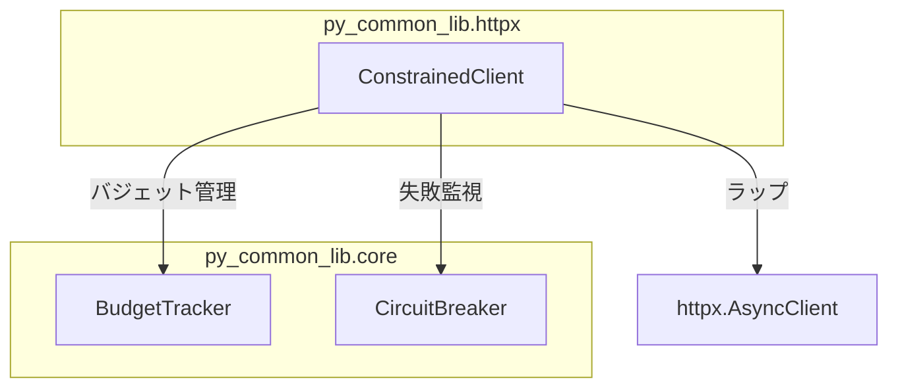

# 制約付き HTTP クライアント

## 概要

外部 HTTP リクエストのゲートウェイとして機能する制約付きクライアントライブラリ。
バジェット管理・サーキットブレーカー・レート制限・タイムアウトを統合し、
安全なリクエスト実行を保証する。

スコープ:

- リクエスト総数の追跡と上限制御（BudgetTracker）
- 連続失敗の監視と自動中断（CircuitBreaker）
- リクエスト間隔の制御（レート制限）
- httpx.AsyncClient のラップと全制約の統合（ConstrainedClient）

## 背景

- 外部 Web サイトへの HTTP リクエストを伴う操作では、暴走リクエスト・連続失敗による負荷集中・タイムアウトなしの長時間処理が安全上のリスクとなる
- 個々の安全制約を各プロジェクトで重複実装するのではなく、共通ライブラリとして一元管理し、安全性を構造的に担保する
- ハードリミットはコード内定数として定義し、設定・引数・環境変数のいかなる手段でも引き上げできない設計とする

## 制約

- ハードリミット（コード内定数。設定・引数・環境変数で引き上げ不可。引き下げは可能）:
  - 操作あたりリクエスト総数上限: 10,000
  - 最低リクエスト間隔: 0.1 秒
  - 操作全体タイムアウト: 600 秒（許容範囲 1〜600 秒）
  - サーキットブレーカー閾値: 5 回連続失敗
- リクエストタイムアウト: 許容範囲 1〜120 秒、デフォルト 30 秒
- リクエスト間隔: 許容範囲 0.5〜60 秒、デフォルト 1.0 秒
- 設定値がハードリミットの許容範囲外の場合は範囲内にクランプする（エラーにはしない。警告ログを出力する）
- SSRF 対策としてリダイレクト追従はデフォルト無効（`follow_redirects=False`）

## 安全制約

| 制約名 | 種別 | 値 | 解除可否 |
|--------|------|-----|---------|
| 操作あたりリクエスト総数上限 | ハードリミット | 10,000 | 引き上げ不可（引き下げ可） |
| 最低リクエスト間隔 | ハードリミット | 0.1 秒 | 引き下げ不可（引き上げ可、上限 60 秒） |
| 操作全体タイムアウト | ハードリミット | 600 秒、許容範囲 1〜600 秒 | 引き上げ不可（引き下げ可、下限 1 秒） |
| サーキットブレーカー閾値 | ハードリミット | 5 回連続失敗 | 引き上げ不可（引き下げ可） |
| リクエストタイムアウト | 設定値 | 許容範囲 1〜120 秒、デフォルト 30 秒 | 範囲内で変更可 |
| リクエスト間隔 | 設定値 | 許容範囲 0.5〜60 秒、デフォルト 1.0 秒 | 範囲内で変更可 |
| リダイレクト追従 | デフォルト無効 | `follow_redirects=False` | メソッド呼び出し時に明示的に有効化可 |

## 想定プロファイル

本ライブラリは汎用部品であり、操作パイプラインの構成は利用先プロジェクトに依存する。想定プロファイル（最悪ケースリクエスト数・所要時間・想定エラー率）は利用先プロジェクトの仕様書で定義すること。

## インターフェース

### BudgetTracker

操作あたりのリクエスト総数を追跡し、ハードリミット上限で停止する。HTTP に依存しないコアコンポーネント。

| 操作 | 振る舞い |
|------|---------|
| 初期化 | `max_requests` を受け取り、ハードリミット 10,000 を超える値はクランプする。1 未満は 1 にクランプ |
| 消費 | リクエスト 1 件分のバジェットを消費する。上限到達時は `BudgetExhaustedError` を送出 |
| リセット | カウンタを 0 に戻す |
| 状態参照 | 消費済み数・残数・上限値を参照可能 |

### CircuitBreaker

連続失敗回数を監視し、閾値超過で操作を中断する。HTTP に依存しないコアコンポーネント。

| 操作 | 振る舞い |
|------|---------|
| 初期化 | `threshold` を受け取り、ハードリミット 5 を超える値はクランプする。1 未満は 1 にクランプ |
| 失敗記録 | 連続失敗カウンタをインクリメントする。閾値到達時は `CircuitBreakerOpenError` を送出 |
| 成功記録 | 連続失敗カウンタを 0 にリセットする |
| リセット | カウンタを 0 に戻す |
| 状態参照 | 連続失敗回数・閾値・発動中かどうかを参照可能 |

### ConstrainedClient

httpx.AsyncClient をラップし、全制約を統合する。async context manager として使用する。

#### 初期化パラメータ

| パラメータ | 型 | デフォルト | 説明 |
|-----------|---|----------|------|
| `request_timeout` | `float` | 30.0 | 個別リクエストタイムアウト（秒）。許容範囲: 1〜120 |
| `request_interval` | `float` | 1.0 | リクエスト間隔（秒）。許容範囲: 0.1〜60 |
| `max_requests` | `int` | 10,000 | 操作あたりリクエスト上限。上限: 10,000 |
| `circuit_breaker_threshold` | `int` | 5 | サーキットブレーカー閾値。上限: 5 |
| `operation_timeout` | `float` | 600.0 | 操作全体タイムアウト（秒）。許容範囲: 1〜600 |
| `headers` | `dict[str, str] \| None` | None | HTTP ヘッダー |

| 操作 | 振る舞い |
|------|---------|
| コンテキスト開始 | バジェット・サーキットブレーカーをリセットし、新しい httpx.AsyncClient セッションを作成する |
| コンテキスト終了 | セッションをクローズする |
| GET | 全制約を適用した上で GET リクエストを実行する |
| POST | 全制約を適用した上で POST リクエストを実行する。JSON ボディ・クエリパラメータに対応 |

#### 制約適用順序

1. 操作全体タイムアウトチェック
2. サーキットブレーカー状態チェック（発動中なら例外）
3. レート制限待機（ロックで直列化）
4. 操作全体タイムアウト再チェック（レート制限待機後）
5. バジェット消費

#### HTTP メソッドの成功・失敗判定

- 成功: HTTP レスポンスを受信できた場合（ステータスコードによらず）→ 連続失敗カウンタをリセット
- 失敗: リクエスト中に例外が発生した場合 → 連続失敗を記録し、例外を再送出

### クランプ関数

ConstrainedClient の初期化時に内部で使用されるクランプロジックを、パブリックユーティリティとして提供する。利用先プロジェクトが ConstrainedClient に渡す前に値を事前クランプする用途を想定する。

| 関数 | 入力 | クランプ範囲 | 振る舞い |
|------|------|------------|---------|
| `clamp_request_timeout` | タイムアウト値（秒） | 1.0〜120.0 | 範囲外の値をクランプし、変更時は警告ログを出力 |
| `clamp_request_interval` | リクエスト間隔（秒） | 0.1〜60.0 | 範囲外の値をクランプし、変更時は警告ログを出力 |
| `clamp_operation_timeout` | 操作タイムアウト（秒） | 1.0〜600.0 | 範囲外の値をクランプし、変更時は警告ログを出力 |

### エラー型

| エラー | 発生条件 |
|--------|---------|
| `BudgetExhaustedError` | バジェット上限到達 |
| `CircuitBreakerOpenError` | サーキットブレーカー発動 |
| `TimeoutError` | 操作全体タイムアウト超過 |
| `RuntimeError` | context manager 外でのメソッド呼び出し |

## コンポーネント構成

- `core/`: HTTP に依存しないコアコンポーネント。BudgetTracker と CircuitBreaker を提供
- `httpx/`: httpx 固有の実装。ConstrainedClient が core コンポーネントと httpx.AsyncClient を統合

## エッジケース

| ケース | 振る舞い |
|--------|---------|
| context manager 外での GET/POST 呼び出し | `RuntimeError` を送出 |
| 設定値がハードリミット超過 | ハードリミット値にクランプし、警告ログを出力 |
| 設定値が下限未満 | 下限値にクランプし、警告ログを出力 |
| 複数コルーチンからの同時リクエスト | レート制限はロックにより直列化 |
| サーキットブレーカー発動中のリクエスト | 即座に `CircuitBreakerOpenError` を送出 |

## 関連ドキュメント

- [rag-knowledge 仕様書](https://github.com/becky3/rag-knowledge/blob/main/docs/specs/rag-knowledge.md) — 最初の利用先プロジェクト。想定プロファイルは rag-knowledge 仕様書側で定義している
