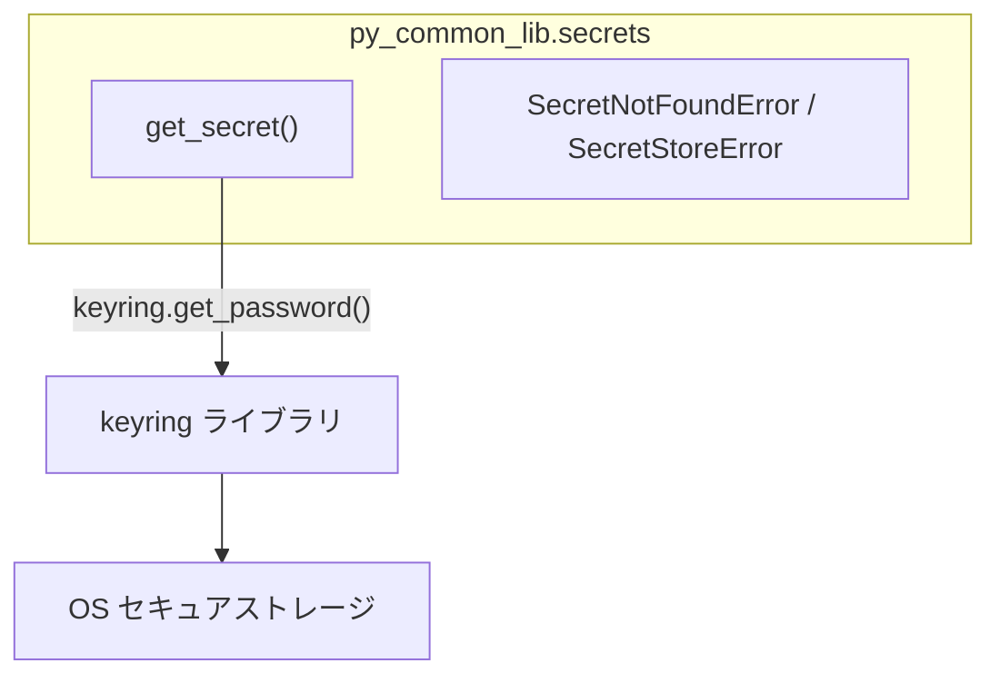

# シークレットストア

## 概要

OS のセキュアストレージ（Windows Credential Manager 等）からシークレットを取得する共通モジュール。

スコープ:

- セキュアストレージからのシークレット取得
- サービス名の規約統一
- 未登録キーの明確なエラーハンドリング

スコープ外:

- シークレットの登録・削除（運用者が手動で実施する）
- アクセス時の認証制御（OS のセキュアストレージの仕様に依存する）

## 背景

- 複数プロジェクトで共通のシークレット取得パターンを提供し、サービス名の規約・エラーハンドリングを統一する

## 制約

- シークレットの取得のみを提供する。登録・削除はスコープ外とし、運用者が keyring CLI または Python スクリプトで事前に登録する
- バックエンドは keyring ライブラリのプラットフォーム自動選択に従う（Windows: WinVaultKeyring 等）
- 未登録のシークレットを取得しようとした場合はエラーとする（フォールバックしない）
- シークレットの取得経路を単一に限定する。環境変数等へのフォールバックは行わない
- 運用者が事前にシークレットを登録する。登録コマンド例:

```
uv run python -c "import keyring; keyring.set_password('<service>', '<key>', input('Value: '))"
```

## インターフェース

本仕様書の識別子（`get_secret`, `SecretNotFoundError`, `SecretStoreError`）は新規に導入するものである。

### get_secret

指定されたサービス名・キー名でセキュアストレージからシークレットを取得する。

| パラメータ | 型 | デフォルト | 説明 |
|-----------|-----|-----------|------|
| `key` | `str` | ― | シークレットのキー名（例: `"OPENAI_API_KEY"`） |
| `service` | `str` | ― | サービス名（例: `"rag-knowledge"`）。プロジェクト単位で名前空間を分離する |

| 戻り値 | 型 | 説明 |
|--------|-----|------|
| シークレット値 | `str` | 取得した秘匿情報の文字列 |

| エラー | 発生条件 |
|--------|---------|
| `SecretNotFoundError` | 指定されたサービス名・キー名の組み合わせが未登録 |
| `SecretStoreError` | バックエンドへのアクセスに失敗（keyring 未設定等） |

### エラー型

| エラー | 基底クラス | 用途 |
|--------|-----------|------|
| `SecretStoreError` | `Exception` | シークレットストア関連エラーの基底クラス |
| `SecretNotFoundError` | `SecretStoreError` | シークレット未登録時のエラー |

## コンポーネント構成



- `secrets/`: keyring を介したシークレット取得を提供。HTTP・ネットワーク通信なし

## エッジケース

| ケース | 振る舞い |
|--------|---------|
| 未登録のキーを取得 | `SecretNotFoundError` を送出。エラーメッセージにサービス名とキー名を含める |
| keyring バックエンドが利用不可 | `SecretStoreError` を送出。バックエンドが `fail` や `null` に設定されている場合、またはセキュアストレージサービスにアクセスできない場合に発生する |
| 空文字列が登録されている | 正常に空文字列を返す（未登録とは区別する） |

## 関連ドキュメント

- [rag-knowledge](https://github.com/becky3/rag-knowledge) — 最初の利用先プロジェクト
