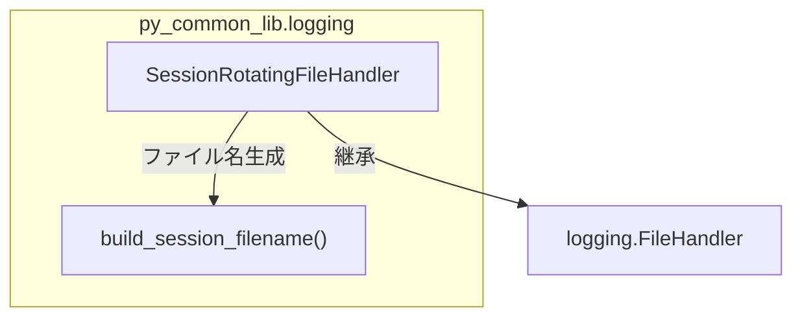

# セッション単位ローテーションファイルハンドラ

## 概要

サイズ超過時に新ファイルへ切り替えるログファイルハンドラ。旧ファイルは削除せず保持する。

スコープ:

- セッション開始時刻と連番に基づくログファイル名の生成
- サイズ閾値超過時のファイル切り替え（旧ファイル保持）
- Python 標準 `logging.FileHandler` の拡張

## 背景

- Python 標準の `RotatingFileHandler` は `backupCount=0` でローテーション自体が無効化されるため、「サイズ超過で切り替えるが旧ファイルは消さない」という要件を満たせない
- rag-knowledge で実装済みのカスタムハンドラを共通化し、複数プロジェクト（rag-knowledge, ai-assistant 等）から利用可能にする

## 制約

- ファイル名形式は `{prefix}YYYYMMDD-HHMMSS-NNNNN.log` で固定（NNNNN は 5 桁ゼロパディング連番）
- 連番はセッション開始時に 00001 から始まる
- `max_bytes` は正値必須（0 以下は `ValueError`）
- 初期化時に対象ファイルが既に存在する場合は `FileExistsError` を送出する（既存ファイルの上書き防止）
- ロールオーバー先ファイルが既に存在する場合も `FileExistsError` を送出する（`emit` 経由で `handleError` に委ねる）
- `stream` が `None` の状態で `emit` された場合、追記モード（`mode='a'`）で再オープンする（既存内容の truncate 防止）

## インターフェース

### build_session_filename

セッション開始時刻と連番からログファイル名を組み立てるユーティリティ関数。

| 引数 | 型 | 説明 |
|------|---|------|
| `prefix` | `str` | ファイル名プレフィックス（例: `"app-server-"`） |
| `started_at` | `datetime` | セッション開始時刻 |
| `sequence` | `int` | 連番 |

戻り値: `str` — `{prefix}YYYYMMDD-HHMMSS-NNNNN.log` 形式のファイル名

### SessionRotatingFileHandler

`logging.FileHandler` を継承したカスタムハンドラ。

#### 初期化パラメータ

| パラメータ | 型 | デフォルト | 説明 |
|-----------|---|----------|------|
| `log_dir` | `Path` | — | ログファイルの出力ディレクトリ |
| `prefix` | `str` | — | ファイル名プレフィックス |
| `started_at` | `datetime` | — | セッション開始時刻 |
| `max_bytes` | `int` | — | ファイルサイズ閾値（バイト、正値必須）。超過で新ファイルへ切り替え |
| `encoding` | `str` | `"utf-8"` | ファイルエンコーディング |

#### 振る舞い

| 操作 | 振る舞い |
|------|---------|
| 初期化 | `log_dir` に連番 00001 のファイルを作成モード（`mode='w'`）で開く。ファイルが既存の場合は `FileExistsError` |
| emit | 書き込み前にファイルサイズを確認し、`max_bytes` 以上であれば新ファイルへ切り替えてから書き込む |
| ロールオーバー | 現在のストリームを閉じ、連番をインクリメントして新ファイルを作成モード（`mode='w'`）で開く。切り替え先が既存の場合は `FileExistsError`（`handleError` に委ねる） |
| stream 再オープン | `stream` が `None` の状態で `emit` された場合、追記モード（`mode='a'`）でファイルを再オープンする |

#### サイズ判定

`TextIOWrapper.tell()` はエンコーディング状態を含む不透明値のためサイズ判定に使用しない。`Path.stat().st_size` で実ファイルサイズを取得して判定する。

## コンポーネント構成

- `logging/`: Python 標準 logging の拡張。`SessionRotatingFileHandler` と `build_session_filename` を提供

## エッジケース

| ケース | 振る舞い |
|--------|---------|
| 初期化時にファイルが既存 | `FileExistsError` を送出 |
| ロールオーバー先ファイルが既存 | `FileExistsError` を `handleError` に委ねる |
| `stream` が `None` で `emit` | 追記モードで再オープン（既存内容を保持） |
| `max_bytes` が非常に小さい値 | 毎回ロールオーバーが発生するが正常動作する |

## 関連ドキュメント

- [rag-knowledge 仕様書](https://github.com/becky3/rag-knowledge/blob/main/docs/specs/rag-knowledge.md) — 移植元プロジェクト。ログファイル出力の仕様定義
- [制約付き HTTP クライアント](constrained-client.md) — 同パッケージの既存仕様書
